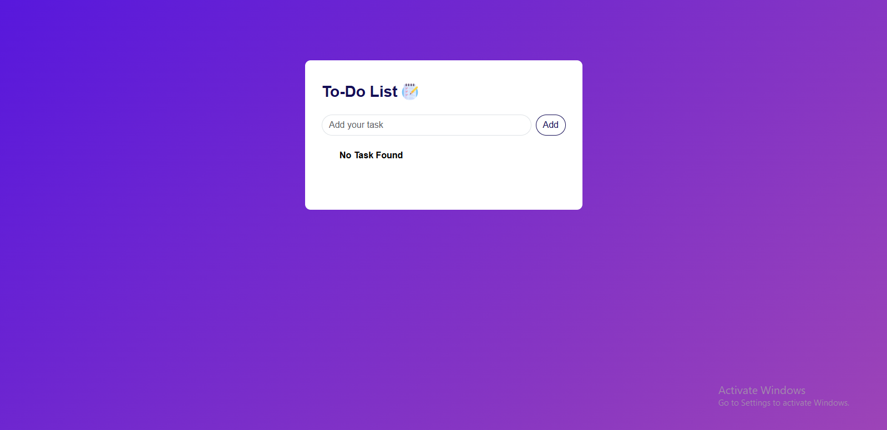
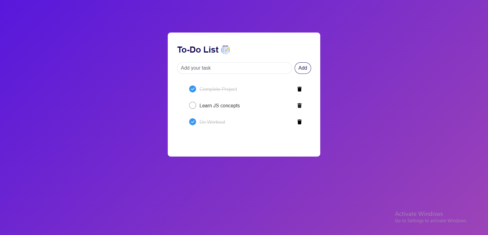

# To-Do List Web App

## 📌 Overview

This is a simple **To-Do List** web application built with **HTML, CSS, and JavaScript**. The app allows users to add, mark as completed, and delete tasks. Tasks are also stored in **local storage**, so they remain saved even after the page is refreshed.

## 🛠️ Features

✅ Add tasks to the list\
✅ Mark tasks as completed (strikethrough effect)\
✅ Remove tasks from the list\
✅ Stores tasks in **local storage** (persists after page refresh)\
✅ Alert message if trying to add an empty task\
✅ Responsive design for different screen sizes

## 🎨 Technologies Used

- HTML
- CSS (Bootstrap + Custom Styling)
- JavaScript (DOM Manipulation & Local Storage)

## 👤 Project Structure

```
To-Do List/
│-- index.html          # Main HTML file
│-- style.css           # Stylesheet for UI design
│-- script.js           # JavaScript for app functionality
│-- images/             # Contains images like todo_icon.png, check.png, and screenshots
│-- README.md           # Project documentation (this file)
```

## 🚀 How to Use

1. Clone this repository:
   ```sh
   git clone https://github.com/thebeliever1812/to-do-list-repo.git
   ```
2. Navigate to the project folder:
   ```sh
   cd to-do-list-repo
   ```
3. Open `index.html` in a browser.

## 📷 Screenshots

### **Main Interface:**


### **Adding a Task:**


### **Completed Task:**


## 📌 Functionality Details

### **Adding a Task**

- Type a task in the input field and click the "Add" button.
- The task appears in the list below.

### **Marking a Task as Completed**

- Click on a task to toggle the completed (strikethrough) effect.

### **Deleting a Task**

- Click the **trash icon** next to a task to remove it from the list.

### **Persistent Data with Local Storage**

- Tasks are stored in the browser's **local storage**.
- If you refresh the page, tasks will remain saved.

## ⭐ Contribute

Feel free to fork this repository and submit pull requests to improve the project! 😊

